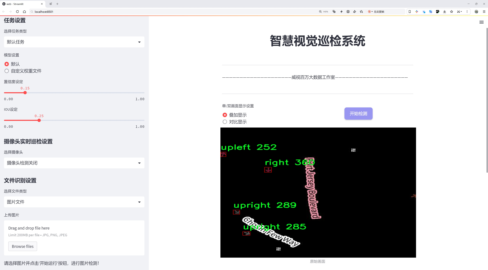
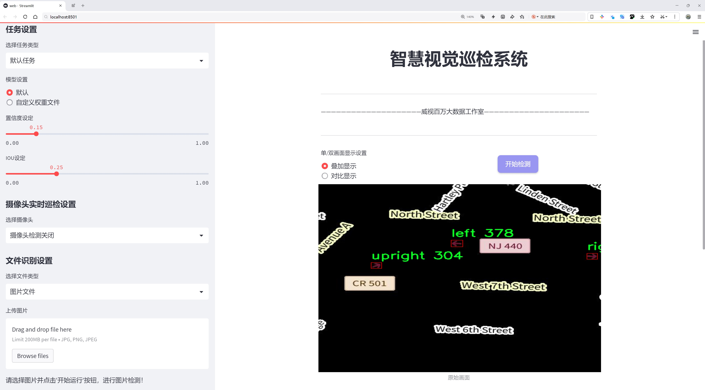
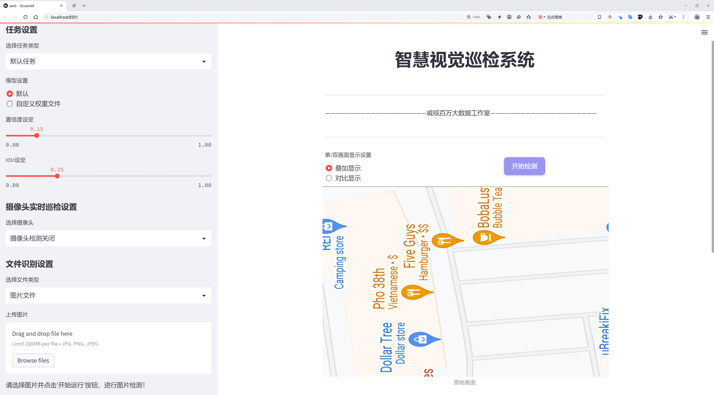
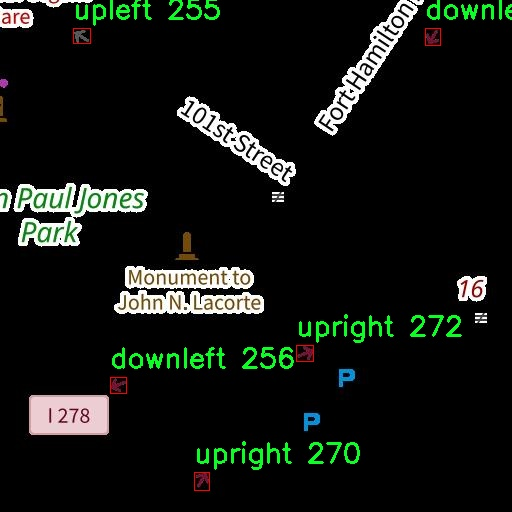
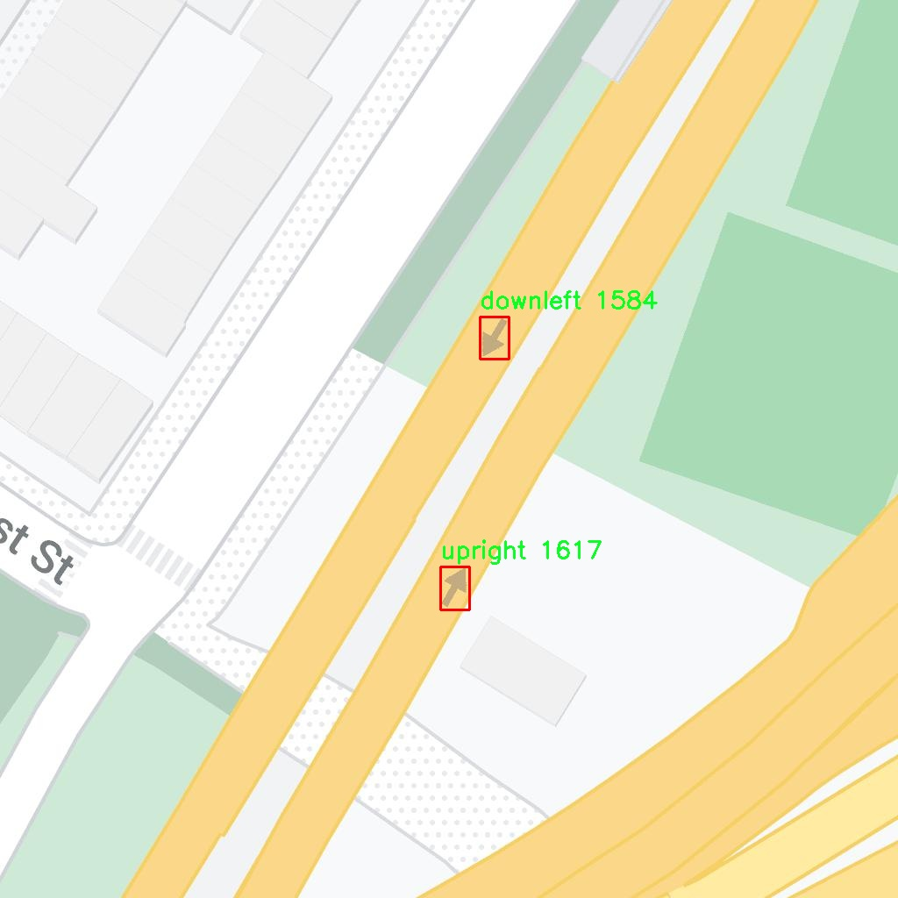

# 地图箭头方向检测系统源码分享
 # [一条龙教学YOLOV8标注好的数据集一键训练_70+全套改进创新点发刊_Web前端展示]

### 1.研究背景与意义

项目参考[AAAI Association for the Advancement of Artificial Intelligence](https://gitee.com/qunmasj/projects)

项目来源[AACV Association for the Advancement of Computer Vision](https://kdocs.cn/l/cszuIiCKVNis)

研究背景与意义

随着智能交通系统的快速发展，交通安全和效率的提升已成为城市管理者和研究者关注的重点。在这一背景下，交通标志的自动识别与解析技术逐渐受到重视，尤其是方向指示箭头的检测与识别。方向箭头作为交通标志的重要组成部分，能够有效引导驾驶员的行驶方向，减少交通事故的发生。然而，传统的方向箭头检测方法多依赖于人工识别和简单的图像处理技术，存在效率低、准确性差等问题。因此，开发一种高效、准确的自动检测系统显得尤为重要。

近年来，深度学习技术的迅猛发展为目标检测领域带来了新的机遇。YOLO（You Only Look Once）系列模型因其高效的实时检测能力和较高的准确性，已成为目标检测领域的热门选择。YOLOv8作为该系列的最新版本，结合了多种先进的网络结构和优化算法，具有更强的特征提取能力和更快的推理速度。然而，尽管YOLOv8在一般目标检测任务中表现优异，但在特定应用场景下，如交通箭头方向检测，仍需进行针对性的改进和优化。

本研究旨在基于改进的YOLOv8模型，构建一个高效的地图箭头方向检测系统。为此，我们采用了一个包含446张图像的ArrowDetection数据集，该数据集涵盖了8个方向类（下、左下、右下、左、右、上、左上、右上），为模型的训练和测试提供了丰富的样本。通过对数据集的深入分析，我们可以发现不同方向箭头的形状、颜色和背景等特征差异，这为模型的训练提供了多样性和挑战性。为了提高模型在特定方向箭头检测任务中的表现，我们将对YOLOv8进行改进，重点优化其特征提取层和检测头，以提升对不同方向箭头的识别能力。

本研究的意义不仅在于提升交通标志的自动识别技术，更在于为智能交通系统的建设提供一种新的解决方案。通过实现高效的方向箭头检测，我们可以为自动驾驶、智能导航等应用提供重要的技术支持，从而推动交通领域的智能化进程。此外，研究成果也将为后续的目标检测任务提供借鉴，促进深度学习技术在更多领域的应用。

综上所述，基于改进YOLOv8的地图箭头方向检测系统的研究，具有重要的理论价值和实际意义。它不仅为交通安全提供了技术保障，也为智能交通系统的进一步发展奠定了基础。通过本研究，我们希望能够为交通管理者、研究者及相关企业提供有效的技术支持，推动交通领域的智能化与自动化进程。

### 2.图片演示







##### 注意：由于此博客编辑较早，上面“2.图片演示”和“3.视频演示”展示的系统图片或者视频可能为老版本，新版本在老版本的基础上升级如下：（实际效果以升级的新版本为准）

  （1）适配了YOLOV8的“目标检测”模型和“实例分割”模型，通过加载相应的权重（.pt）文件即可自适应加载模型。

  （2）支持“图片识别”、“视频识别”、“摄像头实时识别”三种识别模式。

  （3）支持“图片识别”、“视频识别”、“摄像头实时识别”三种识别结果保存导出，解决手动导出（容易卡顿出现爆内存）存在的问题，识别完自动保存结果并导出到tempDir中。

  （4）支持Web前端系统中的标题、背景图等自定义修改，后面提供修改教程。

  另外本项目提供训练的数据集和训练教程,暂不提供权重文件（best.pt）,需要您按照教程进行训练后实现图片演示和Web前端界面演示的效果。

### 3.视频演示

[3.1 视频演示](https://www.bilibili.com/video/BV1Tt1kY9EdQ/)

### 4.数据集信息展示

##### 4.1 本项目数据集详细数据（类别数＆类别名）

nc: 8
names: ['down', 'downleft', 'downright', 'left', 'right', 'up', 'upleft', 'upright']


##### 4.2 本项目数据集信息介绍

数据集信息展示

在现代计算机视觉领域，目标检测技术的不断进步为多种应用场景提供了强有力的支持，尤其是在交通管理和智能驾驶系统中。为此，我们构建了一个专门用于训练和改进YOLOv8模型的“ArrowDetection”数据集，旨在提高地图箭头方向检测的准确性和效率。该数据集的设计充分考虑了不同方向箭头的多样性与复杂性，确保能够有效地训练出具有良好泛化能力的检测模型。

“ArrowDetection”数据集包含8个类别，分别为：向下（down）、向左下（downleft）、向右下（downright）、向左（left）、向右（right）、向上（up）、向左上（upleft）和向右上（upright）。这些类别涵盖了所有可能的箭头方向，能够满足不同交通场景和地图应用的需求。每个类别的箭头图像都经过精心挑选，确保在各种光照、角度和背景下的可识别性。这种多样化的样本选择不仅增强了数据集的代表性，还为模型的训练提供了丰富的上下文信息。

数据集中的每个图像都附带了详细的标注信息，标注格式遵循行业标准，确保与YOLOv8模型的输入要求相兼容。通过使用高质量的标注工具，我们能够准确地为每个箭头标记其类别及位置，这为后续的模型训练和评估提供了坚实的基础。此外，数据集还包括了多种不同的场景，如城市道路、乡村小道和高速公路等，以模拟真实世界中可能遇到的各种情况。这种场景多样性不仅提高了模型的鲁棒性，也为实际应用中的箭头检测提供了更为可靠的支持。

在数据集的构建过程中，我们还特别关注了数据的平衡性。为了避免模型在某些类别上过拟合，我们确保每个类别的样本数量相对均衡。这种设计使得模型在学习过程中能够更全面地理解各个方向箭头的特征，从而提升整体检测性能。此外，为了进一步增强模型的适应性，我们还考虑了数据增强技术的应用，包括随机旋转、缩放、翻转和颜色变换等，这些技术能够有效扩展训练样本的多样性，提升模型在实际应用中的表现。

“ArrowDetection”数据集的构建不仅是为了满足YOLOv8模型的训练需求，更是为了推动智能交通系统的发展。通过高效、准确的箭头方向检测，我们希望能够为交通管理、导航系统以及自动驾驶技术提供更为可靠的支持。随着数据集的不断优化和扩展，我们相信它将在未来的研究和应用中发挥重要作用，助力计算机视觉技术的进一步发展。







### 5.全套项目环境部署视频教程（零基础手把手教学）

[5.1 环境部署教程链接（零基础手把手教学）](https://www.ixigua.com/7404473917358506534?logTag=c807d0cbc21c0ef59de5)


[5.2 安装Python虚拟环境创建和依赖库安装视频教程链接（零基础手把手教学）](https://www.ixigua.com/7404474678003106304?logTag=1f1041108cd1f708b01a)

### 6.手把手YOLOV8训练视频教程（零基础小白有手就能学会）

[6.1 手把手YOLOV8训练视频教程（零基础小白有手就能学会）](https://www.ixigua.com/7404477157818401292?logTag=d31a2dfd1983c9668658)


按照上面的训练视频教程链接加载项目提供的数据集，运行train.py即可开始训练



     Epoch   gpu_mem       box       obj       cls    labels  img_size
     1/200     20.8G   0.01576   0.01955  0.007536        22      1280: 100%|██████████| 849/849 [14:42<00:00,  1.04s/it]
               Class     Images     Labels          P          R     mAP@.5 mAP@.5:.95: 100%|██████████| 213/213 [01:14<00:00,  2.87it/s]
                 all       3395      17314      0.994      0.957      0.0957      0.0843

     Epoch   gpu_mem       box       obj       cls    labels  img_size
     2/200     20.8G   0.01578   0.01923  0.007006        22      1280: 100%|██████████| 849/849 [14:44<00:00,  1.04s/it]
               Class     Images     Labels          P          R     mAP@.5 mAP@.5:.95: 100%|██████████| 213/213 [01:12<00:00,  2.95it/s]
                 all       3395      17314      0.996      0.956      0.0957      0.0845

     Epoch   gpu_mem       box       obj       cls    labels  img_size
     3/200     20.8G   0.01561    0.0191  0.006895        27      1280: 100%|██████████| 849/849 [10:56<00:00,  1.29it/s]
               Class     Images     Labels          P          R     mAP@.5 mAP@.5:.95: 100%|███████   | 187/213 [00:52<00:00,  4.04it/s]
                 all       3395      17314      0.996      0.957      0.0957      0.0845


### 7.70+种全套YOLOV8创新点代码加载调参视频教程（一键加载写好的改进模型的配置文件）

[7.1 70+种全套YOLOV8创新点代码加载调参视频教程（一键加载写好的改进模型的配置文件）](https://www.ixigua.com/7404478314661806627?logTag=29066f8288e3f4eea3a4)

### 8.70+种全套YOLOV8创新点原理讲解（非科班也可以轻松写刊发刊，V10版本正在科研待更新）

#### 由于篇幅限制，每个创新点的具体原理讲解就不一一展开，具体见下列网址中的创新点对应子项目的技术原理博客网址【Blog】：


[8.1 70+种全套YOLOV8创新点原理讲解链接](https://gitee.com/qunmasj/good)

#### 部分改进原理讲解(完整的改进原理见上图和技术博客链接)
### FasterNet简介
神经网络在图像分类、检测和分割等各种计算机视觉任务中经历了快速发展。尽管其令人印象深刻的性能为许多应用程序提供了动力，但一个巨大的趋势是追求具有低延迟和高吞吐量的快速神经网络，以获得良好的用户体验、即时响应和安全原因等。

如何快速？研究人员和从业者不需要更昂贵的计算设备，而是倾向于设计具有成本效益的快速神经网络，降低计算复杂度，主要以浮点运算（FLOPs）的数量来衡量。

MobileNet、ShuffleNet和GhostNet等利用深度卷积（DWConv）和/或组卷积（GConv）来提取空间特征。然而，在减少FLOPs的过程中，算子经常会受到内存访问增加的副作用的影响。MicroNet进一步分解和稀疏网络，将其FLOPs推至极低水平。尽管这种方法在FLOPs方面有所改进，但其碎片计算效率很低。此外，上述网络通常伴随着额外的数据操作，如级联、Shuffle和池化，这些操作的运行时间对于小型模型来说往往很重要。

除了上述纯卷积神经网络（CNNs）之外，人们对使视觉Transformer（ViTs）和多层感知器（MLP）架构更小更快也越来越感兴趣。例如，MobileViT和MobileFormer通过将DWConv与改进的注意力机制相结合，降低了计算复杂性。然而，它们仍然受到DWConv的上述问题的困扰，并且还需要修改的注意力机制的专用硬件支持。使用先进但耗时的标准化和激活层也可能限制其在设备上的速度。

所有这些问题一起导致了以下问题：这些“快速”的神经网络真的很快吗？为了回答这个问题，作者检查了延迟和FLOPs之间的关系，这由


其中FLOPS是每秒浮点运算的缩写，作为有效计算速度的度量。虽然有许多减少FLOPs的尝试，但都很少考虑同时优化FLOPs以实现真正的低延迟。为了更好地理解这种情况，作者比较了Intel CPU上典型神经网络的FLOPS。


图中的结果表明，许多现有神经网络的FLOPS较低，其FLOPS通常低于流行的ResNet50。由于FLOPS如此之低，这些“快速”的神经网络实际上不够快。它们的FLOPs减少不能转化为延迟的确切减少量。在某些情况下，没有任何改善，甚至会导致更糟的延迟。例如，CycleMLP-B1具有ResNet50的一半FLOPs，但运行速度较慢（即CycleMLPB1与ResNet50:111.9ms与69.4ms）。

请注意，FLOPs与延迟之间的差异在之前的工作中也已被注意到，但由于它们采用了DWConv/GConv和具有低FLOPs的各种数据处理，因此部分问题仍未解决。人们认为没有更好的选择。

该博客提供的方案通过开发一种简单、快速、有效的运算符来消除这种差异，该运算符可以在减少FLOPs的情况下保持高FLOPS。

具体来说，作者重新审视了现有的操作符，特别是DWConv的计算速度——FLOPS。作者发现导致低FLOPS问题的主要原因是频繁的内存访问。然后，作者提出了PConv作为一种竞争性替代方案，它减少了计算冗余以及内存访问的数量。

图1说明了PConv的设计。它利用了特征图中的冗余，并系统地仅在一部分输入通道上应用规则卷积（Conv），而不影响其余通道。本质上，PConv的FLOPs低于常规Conv，而FLOPs高于DWConv/GConv。换句话说，PConv更好地利用了设备上的计算能力。PConv在提取空间特征方面也很有效，这在本文后面的实验中得到了验证。

作者进一步引入PConv设计了FasterNet作为一个在各种设备上运行速度非常快的新网络家族。特别是，FasterNet在分类、检测和分割任务方面实现了最先进的性能，同时具有更低的延迟和更高的吞吐量。例如，在GPU、CPU和ARM处理器上，小模型FasterNet-T0分别比MobileVitXXS快3.1倍、3.1倍和2.5倍，而在ImageNet-1k上的准确率高2.9%。大模型FasterNet-L实现了83.5%的Top-1精度，与Swin-B不相上下，同时在GPU上提供了49%的高吞吐量，在CPU上节省了42%的计算时间。

总之，贡献如下：

指出了实现更高FLOPS的重要性，而不仅仅是为了更快的神经网络而减少FLOPs。

引入了一种简单但快速且有效的卷积PConv，它很有可能取代现有的选择DWConv。

推出FasterNet，它在GPU、CPU和ARM处理器等多种设备上运行良好且普遍快速。

对各种任务进行了广泛的实验，并验证了PConv和FasterNet的高速性和有效性。

### Conv和FasterNet的设计
#### 原理

DWConv是Conv的一种流行变体，已被广泛用作许多神经网络的关键构建块。对于输入，DWConv应用个滤波器来计算输出。如图（b）所示，每个滤波器在一个输入通道上进行空间滑动，并对一个输出通道做出贡献。

与具有的FLOPs常规Conv相比，这种深度计算使得DWConv仅仅具有的FLOPs。虽然在减少FLOPs方面有效，但DWConv（通常后跟逐点卷积或PWConv）不能简单地用于替换常规Conv，因为它会导致严重的精度下降。因此，在实践中，DWConv的通道数（或网络宽度）增加到＞以补偿精度下降，例如，倒置残差块中的DWConv宽度扩展了6倍。然而，这会导致更高的内存访问，这会造成不可忽略的延迟，并降低总体计算速度，尤其是对于I/O绑定设备。特别是，内存访问的数量现在上升到


它比一个常规的Conv的值要高，即，


注意，内存访问花费在I/O操作上，这被认为已经是最小的成本，很难进一步优化。

#### PConv作为一个基本的算子


在下面演示了通过利用特征图的冗余度可以进一步优化成本。如图所示，特征图在不同通道之间具有高度相似性。许多其他著作也涵盖了这种冗余，但很少有人以简单而有效的方式充分利用它。


具体而言，作者提出了一种简单的PConv，以同时减少计算冗余和内存访问。图4中的左下角说明了PConv的工作原理。它只需在输入通道的一部分上应用常规Conv进行空间特征提取，并保持其余通道不变。对于连续或规则的内存访问，将第一个或最后一个连续的通道视为整个特征图的代表进行计算。在不丧失一般性的情况下认为输入和输出特征图具有相同数量的通道。因此，PConv的FLOPs仅


对于典型的r＝1/4 ，PConv的FLOPs只有常规Conv的1/16。此外，PConv的内存访问量较小，即：


对于r＝1/4，其仅为常规Conv的1/4。

由于只有通道用于空间特征提取，人们可能会问是否可以简单地移除剩余的（c−）通道？如果是这样，PConv将退化为具有较少通道的常规Conv，这偏离了减少冗余的目标。

请注意，保持其余通道不变，而不是从特征图中删除它们。这是因为它们对后续PWConv层有用，PWConv允许特征信息流经所有通道。

#### PConv之后是PWConv


为了充分有效地利用来自所有通道的信息，进一步将逐点卷积（PWConv）附加到PConv。它们在输入特征图上的有效感受野看起来像一个T形Conv，与均匀处理补丁的常规Conv相比，它更专注于中心位置，如图5所示。为了证明这个T形感受野的合理性，首先通过计算位置的Frobenius范数来评估每个位置的重要性。


假设，如果一个职位比其他职位具有更大的Frobenius范数，则该职位往往更重要。对于正则Conv滤波器，位置处的Frobenius范数由计算，其中。


一个显著位置是具有最大Frobenius范数的位置。然后，在预训练的ResNet18中集体检查每个过滤器，找出它们的显著位置，并绘制显著位置的直方图。图6中的结果表明，中心位置是过滤器中最常见的突出位置。换句话说，中心位置的权重比周围的更重。这与集中于中心位置的T形计算一致。

虽然T形卷积可以直接用于高效计算，但作者表明，将T形卷积分解为PConv和PWConv更好，因为该分解利用了滤波器间冗余并进一步节省了FLOPs。对于相同的输入和输出，T形Conv的FLOPs可以计算为:


它高于PConv和PWConv的流量，即：


其中和（例如，当时）。此外，可以很容易地利用常规Conv进行两步实现。

# FasterNet作为Backbone
鉴于新型PConv和现成的PWConv作为主要的算子，进一步提出FasterNet，这是一个新的神经网络家族，运行速度非常快，对许多视觉任务非常有效。目标是使体系结构尽可能简单，使其总体上对硬件友好。


在图中展示了整体架构。它有4个层次级，每个层次级前面都有一个嵌入层（步长为4的常规4×4卷积）或一个合并层（步长为2的常规2×2卷积），用于空间下采样和通道数量扩展。每个阶段都有一堆FasterNet块。作者观察到，最后两个阶段中的块消耗更少的内存访问，并且倾向于具有更高的FLOPS，如表1中的经验验证。因此，放置了更多FasterNet块，并相应地将更多计算分配给最后两个阶段。每个FasterNet块有一个PConv层，后跟2个PWConv（或Conv 1×1）层。它们一起显示为倒置残差块，其中中间层具有扩展的通道数量，并且放置了Shorcut以重用输入特征。

除了上述算子，标准化和激活层对于高性能神经网络也是不可或缺的。然而，许多先前的工作在整个网络中过度使用这些层，这可能会限制特征多样性，从而损害性能。它还可以降低整体计算速度。相比之下，只将它们放在每个中间PWConv之后，以保持特征多样性并实现较低的延迟。

此外，使用批次归一化（BN）代替其他替代方法。BN的优点是，它可以合并到其相邻的Conv层中，以便更快地进行推断，同时与其他层一样有效。对于激活层，根据经验选择了GELU用于较小的FasterNet变体，而ReLU用于较大的FasterNet变体，同时考虑了运行时间和有效性。最后三个层，即全局平均池化、卷积1×1和全连接层，一起用于特征转换和分类。

为了在不同的计算预算下提供广泛的应用，提供FasterNet的Tiny模型、Small模型、Medium模型和Big模型变体，分别称为FasterNetT0/1/2、FasterNet-S、FasterNet-M和FasterNet-L。它们具有相似的结构，但深度和宽度不同。

架构规范如下：


### 9.系统功能展示（检测对象为举例，实际内容以本项目数据集为准）

图9.1.系统支持检测结果表格显示

  图9.2.系统支持置信度和IOU阈值手动调节

  图9.3.系统支持自定义加载权重文件best.pt(需要你通过步骤5中训练获得)

  图9.4.系统支持摄像头实时识别

  图9.5.系统支持图片识别

  图9.6.系统支持视频识别

  图9.7.系统支持识别结果文件自动保存

  图9.8.系统支持Excel导出检测结果数据


### 10.原始YOLOV8算法原理

原始YOLOv8算法原理

YOLOv8算法是由Glenn-Jocher提出的一种新型目标检测算法，继承了YOLO系列的优良传统，尤其是YOLOv3和YOLOv5的设计理念。YOLOv8在多方面进行了改进，旨在提升目标检测的精度和速度，适应更为复杂的应用场景。其核心原理不仅仅是对算法的简单叠加，而是通过深度学习和网络结构的优化，形成了一种更为高效的目标检测方案。

首先，YOLOv8在数据预处理阶段采用了YOLOv5的策略，结合了多种数据增强技术以提高模型的鲁棒性和泛化能力。具体而言，YOLOv8引入了马赛克增强、混合增强、空间扰动和颜色扰动等手段。这些增强方法通过对训练数据进行多样化处理，使得模型能够在面对不同环境和条件下的目标时，依然保持较高的检测精度。马赛克增强通过将多张图像拼接在一起，增加了训练样本的多样性；而混合增强则通过将两张图像进行混合，进一步丰富了样本特征。

在骨干网络结构方面，YOLOv8在YOLOv5的基础上进行了优化，采用了新的C2f模块替代了原有的C3模块。C2f模块通过引入更多的分支，增强了特征提取的能力，使得网络在进行梯度回传时能够更有效地利用不同路径的信息。这种结构的设计不仅提升了特征的表达能力，还有效缓解了深层网络中常见的梯度消失问题，从而提高了模型的训练效率和最终的检测性能。

YOLOv8继续采用了特征金字塔网络（FPN）和路径聚合网络（PAN）的结合结构，这一设计使得多尺度信息能够得到充分融合。FPN通过构建不同层次的特征图，能够捕捉到目标的不同尺度特征，而PAN则在此基础上进一步增强了特征的传递和融合能力。这种结构的优势在于，它能够有效地处理复杂场景中的目标检测任务，确保模型在不同尺度下都能保持较高的检测精度。

在检测头的设计上，YOLOv8采用了解耦头的结构，分别通过两条并行的分支来提取类别特征和位置特征。这种解耦设计使得模型在进行分类和定位时能够独立优化，从而提高了检测的准确性。通过使用1×1卷积层，YOLOv8能够高效地完成分类和定位任务，减少了计算复杂度，同时提升了检测速度。

标签分配策略是YOLOv8的另一个重要改进点。与YOLOv5依赖于候选框聚类的方法不同，YOLOv8采用了动态标签分配策略，即TOOD策略。这一策略通过使用目标边界框和目标分数，动态地为每个样本分配标签，避免了因数据集不足而导致的候选框不准确问题。YOLOv8的损失函数主要由类别损失和位置损失两部分组成，其中类别损失采用了变焦损失（VFL Loss），而位置损失则结合了CIoU Loss和DFL Loss。这种设计使得模型在训练过程中能够更好地关注高质量的正样本，同时降低负样本对损失的影响，从而提升了整体的检测性能。

YOLOv8作为一种基于卷积神经网络的目标检测算法，其设计理念是将整个图像作为输入，直接在图像上进行目标检测和定位。这一方法避免了传统滑动窗口或区域提议的复杂性，使得YOLOv8在处理速度和检测精度上都有了显著提升。通过引入多尺度训练和测试技术，YOLOv8能够在不同的场景下保持良好的性能，广泛应用于智能监控、自动驾驶、人脸识别等领域。

综上所述，YOLOv8算法通过对数据预处理、骨干网络结构、特征融合、检测头设计以及标签分配策略等多个方面的改进，形成了一种高效、准确的目标检测解决方案。其在精度和速度上的双重提升，使得YOLOv8成为当前目标检测领域的重要进展，为各种实际应用提供了强有力的支持。随着YOLO系列算法的不断迭代，YOLOv8不仅在学术研究中引起了广泛关注，也在工业界得到了越来越多的应用，展现出其强大的实用价值和发展潜力。


### 11.项目核心源码讲解（再也不用担心看不懂代码逻辑）

#### 11.1 ui.py

以下是经过简化和注释的核心代码部分：

```python
import sys
import subprocess
from QtFusion.path import abs_path

def run_script(script_path):
    """
    使用当前 Python 环境运行指定的脚本。

    Args:
        script_path (str): 要运行的脚本路径
    """
    # 获取当前 Python 解释器的路径
    python_path = sys.executable

    # 构建运行命令，使用 streamlit 运行指定的脚本
    command = f'"{python_path}" -m streamlit run "{script_path}"'

    # 执行命令并等待其完成
    result = subprocess.run(command, shell=True)
    
    # 检查命令执行的返回码，非零表示出错
    if result.returncode != 0:
        print("脚本运行出错。")

# 主程序入口
if __name__ == "__main__":
    # 获取脚本的绝对路径
    script_path = abs_path("web.py")

    # 运行指定的脚本
    run_script(script_path)
```

### 代码注释说明：
1. **导入模块**：
   - `sys`：用于获取当前 Python 解释器的路径。
   - `subprocess`：用于执行外部命令。
   - `abs_path`：从 `QtFusion.path` 模块导入，用于获取文件的绝对路径。

2. **`run_script` 函数**：
   - 功能：运行指定的 Python 脚本。
   - 参数：`script_path` 是要运行的脚本的路径。
   - 获取当前 Python 解释器的路径，以便在命令中使用。
   - 构建运行命令，使用 `streamlit` 模块来运行脚本。
   - 使用 `subprocess.run` 执行命令，并等待其完成。
   - 检查命令的返回码，如果不为零，则输出错误信息。

3. **主程序入口**：
   - 当脚本作为主程序运行时，获取 `web.py` 的绝对路径。
   - 调用 `run_script` 函数来执行该脚本。

这个程序文件名为 `ui.py`，其主要功能是运行一个指定的 Python 脚本，具体是通过 Streamlit 框架来启动一个 Web 应用。

首先，文件导入了几个必要的模块，包括 `sys`、`os` 和 `subprocess`。其中，`sys` 模块用于访问与 Python 解释器相关的变量和函数，`os` 模块提供了与操作系统交互的功能，而 `subprocess` 模块则用于生成新的进程、连接到它们的输入/输出/错误管道，并获取它们的返回码。

接着，文件中定义了一个名为 `run_script` 的函数，该函数接受一个参数 `script_path`，表示要运行的脚本的路径。在函数内部，首先获取当前 Python 解释器的路径，使用 `sys.executable` 来实现。然后，构建一个命令字符串，命令的格式是使用当前的 Python 解释器来运行 Streamlit，并指定要运行的脚本路径。

使用 `subprocess.run` 方法来执行构建好的命令，并通过 `shell=True` 参数在一个新的 shell 中运行该命令。执行后，函数会检查返回的结果码，如果不为零，表示脚本运行出错，并打印出相应的错误信息。

在文件的最后部分，使用 `if __name__ == "__main__":` 语句来确保只有在直接运行该脚本时才会执行以下代码。这部分代码中，首先通过调用 `abs_path` 函数来获取名为 `web.py` 的脚本的绝对路径。然后，调用之前定义的 `run_script` 函数来运行这个脚本。

总的来说，这个文件的作用是通过 Streamlit 框架启动一个 Web 应用，具体的应用逻辑则在 `web.py` 文件中实现。

#### 11.2 code\ultralytics\engine\exporter.py

以下是经过简化和注释的核心代码部分，主要包括模型导出功能的实现。注释详细解释了每个部分的功能和目的。

```python
import json
import os
import shutil
import subprocess
import time
import warnings
from copy import deepcopy
from datetime import datetime
from pathlib import Path

import torch

from ultralytics.cfg import get_cfg
from ultralytics.utils import (
    LOGGER,
    __version__,
    callbacks,
    colorstr,
    yaml_save,
)
from ultralytics.utils.checks import check_requirements
from ultralytics.utils.torch_utils import select_device

class Exporter:
    """
    用于导出YOLO模型的类。

    属性:
        args (SimpleNamespace): 导出器的配置。
        callbacks (list, optional): 回调函数列表。默认为None。
    """

    def __init__(self, cfg='default_cfg.yaml', overrides=None, _callbacks=None):
        """
        初始化Exporter类。

        参数:
            cfg (str, optional): 配置文件路径。默认为'default_cfg.yaml'。
            overrides (dict, optional): 配置覆盖项。默认为None。
            _callbacks (dict, optional): 回调函数字典。默认为None。
        """
        self.args = get_cfg(cfg, overrides)  # 获取配置
        self.callbacks = _callbacks or callbacks.get_default_callbacks()  # 获取回调函数

    def __call__(self, model=None):
        """执行导出操作并返回导出文件/目录列表。"""
        self.run_callbacks("on_export_start")  # 执行导出开始的回调
        t = time.time()  # 记录开始时间

        # 选择设备（CPU或GPU）
        self.device = select_device("cpu" if self.args.device is None else self.args.device)

        # 检查模型类名
        if not hasattr(model, "names"):
            model.names = []  # 如果没有类名，初始化为空列表

        # 更新模型并准备导出
        model = deepcopy(model).to(self.device)  # 深拷贝模型并转移到指定设备
        model.eval()  # 设置模型为评估模式
        model.float()  # 确保模型使用浮点数

        # 进行一次前向推理以确保模型正确
        im = torch.zeros(self.args.batch, 3, *self.args.imgsz).to(self.device)  # 创建输入张量
        model(im)  # 前向推理

        # 导出模型
        f = self.export_onnx(model, im)  # 导出为ONNX格式
        self.run_callbacks("on_export_end")  # 执行导出结束的回调
        return f  # 返回导出的文件路径

    def export_onnx(self, model, im):
        """导出YOLOv8模型为ONNX格式。"""
        import onnx  # 导入ONNX库

        f = str(Path(self.args.model).with_suffix(".onnx"))  # 设置导出文件名
        torch.onnx.export(
            model.cpu(),  # 将模型转移到CPU
            im.cpu(),  # 将输入转移到CPU
            f,  # 导出文件路径
            opset_version=12,  # ONNX操作集版本
            input_names=["images"],  # 输入名称
            output_names=["output0"],  # 输出名称
        )
        return f  # 返回导出文件路径

    def run_callbacks(self, event: str):
        """执行给定事件的所有回调。"""
        for callback in self.callbacks.get(event, []):
            callback(self)  # 执行每个回调

# 使用示例
# exporter = Exporter(cfg='path/to/config.yaml')
# exported_file = exporter(model)  # 导出模型
```

### 代码说明
1. **导入必要的库**：导入了处理文件、时间、深度学习框架（如PyTorch）和Ultralytics库的模块。
2. **Exporter类**：定义了一个用于导出YOLO模型的类，包含初始化、调用和导出ONNX模型的方法。
3. **初始化方法**：加载配置并设置回调函数。
4. **调用方法**：执行导出过程，包括选择设备、检查模型类名、准备模型、进行前向推理以及导出模型。
5. **导出ONNX方法**：使用PyTorch的`torch.onnx.export`方法将模型导出为ONNX格式。
6. **回调机制**：在导出开始和结束时执行注册的回调函数。

此代码的核心功能是将YOLO模型导出为ONNX格式，并提供了灵活的配置和回调机制以便于扩展和使用。

这个程序文件是用于将YOLOv8模型导出为多种格式的工具，支持多种深度学习框架和推理引擎。文件开头包含了关于导出格式的详细说明，包括每种格式的命令行参数和对应的模型文件名。支持的导出格式包括PyTorch、TorchScript、ONNX、OpenVINO、TensorRT、CoreML、TensorFlow SavedModel、TensorFlow GraphDef、TensorFlow Lite、TensorFlow Edge TPU、TensorFlow.js、PaddlePaddle和ncnn。

程序中定义了一个`Exporter`类，负责处理模型的导出过程。初始化时，该类会读取配置文件和回调函数，并根据需要设置环境变量。导出过程的核心逻辑在`__call__`方法中实现，该方法会根据用户指定的格式执行相应的导出操作。

在导出过程中，程序会首先进行一系列的检查，包括设备选择、模型名称检查、输入图像大小验证等。接着，程序会创建一个空的输入张量，并对模型进行深拷贝，确保在导出过程中不会影响原始模型。然后，程序会进行一次干运行，以确保模型能够正常处理输入。

导出过程会根据指定的格式调用不同的导出方法，例如`export_torchscript`、`export_onnx`、`export_openvino`等。每个导出方法都包含了特定格式的导出逻辑，包括模型的序列化、元数据的保存等。

在导出完成后，程序会记录导出结果，包括导出时间、文件大小等信息，并返回导出的文件路径。程序还提供了回调机制，允许用户在导出开始和结束时执行自定义操作。

此外，程序中还定义了一些辅助函数和类，例如`try_export`装饰器用于捕获导出过程中的异常，`IOSDetectModel`类用于适配iOS CoreML导出。整个程序结构清晰，逻辑严谨，适合用于深度学习模型的多格式导出需求。

#### 11.3 70+种YOLOv8算法改进源码大全和调试加载训练教程（非必要）\ultralytics\utils\callbacks\comet.py

以下是代码中最核心的部分，并附上详细的中文注释：

```python
# 导入必要的库
from ultralytics.utils import LOGGER, RANK, SETTINGS, TESTS_RUNNING, ops
import os
from pathlib import Path

# 检查是否在测试模式下运行
try:
    assert not TESTS_RUNNING  # 确保不是在pytest测试中
    assert SETTINGS['comet'] is True  # 确保Comet集成已启用
    import comet_ml  # 导入Comet库

    assert hasattr(comet_ml, '__version__')  # 确保Comet库已正确安装

except (ImportError, AssertionError):
    comet_ml = None  # 如果导入失败，设置comet_ml为None

def _create_experiment(args):
    """创建Comet实验对象，确保在分布式训练中只在一个进程中创建实验。"""
    if RANK not in (-1, 0):  # 只在主进程中创建实验
        return
    try:
        comet_mode = os.getenv('COMET_MODE', 'online')  # 获取Comet模式
        _project_name = os.getenv('COMET_PROJECT_NAME', args.project)  # 获取项目名称
        experiment = comet_ml.Experiment(project_name=_project_name) if comet_mode != 'offline' else comet_ml.OfflineExperiment(project_name=_project_name)
        experiment.log_parameters(vars(args))  # 记录参数
        # 记录其他设置
        experiment.log_others({
            'eval_batch_logging_interval': int(os.getenv('COMET_EVAL_BATCH_LOGGING_INTERVAL', 1)),
            'log_confusion_matrix_on_eval': os.getenv('COMET_EVAL_LOG_CONFUSION_MATRIX', 'false').lower() == 'true',
            'log_image_predictions': os.getenv('COMET_EVAL_LOG_IMAGE_PREDICTIONS', 'true').lower() == 'true',
            'max_image_predictions': int(os.getenv('COMET_MAX_IMAGE_PREDICTIONS', 100)),
        })
        experiment.log_other('Created from', 'yolov8')  # 记录创建来源

    except Exception as e:
        LOGGER.warning(f'WARNING ⚠️ Comet installed but not initialized correctly, not logging this run. {e}')  # 记录警告信息

def on_train_epoch_end(trainer):
    """在每个训练周期结束时记录指标和保存批次图像。"""
    experiment = comet_ml.get_global_experiment()  # 获取当前的Comet实验
    if not experiment:
        return  # 如果没有实验，直接返回

    metadata = _fetch_trainer_metadata(trainer)  # 获取训练器的元数据
    curr_epoch = metadata['curr_epoch']  # 当前周期
    curr_step = metadata['curr_step']  # 当前步骤

    experiment.log_metrics(  # 记录训练指标
        trainer.label_loss_items(trainer.tloss, prefix='train'),
        step=curr_step,
        epoch=curr_epoch,
    )

    if curr_epoch == 1:  # 如果是第一个周期，记录训练批次图像
        _log_images(experiment, trainer.save_dir.glob('train_batch*.jpg'), curr_step)

def on_train_end(trainer):
    """在训练结束时执行操作。"""
    experiment = comet_ml.get_global_experiment()  # 获取当前的Comet实验
    if not experiment:
        return  # 如果没有实验，直接返回

    metadata = _fetch_trainer_metadata(trainer)  # 获取训练器的元数据
    curr_epoch = metadata['curr_epoch']  # 当前周期
    curr_step = metadata['curr_step']  # 当前步骤

    _log_model(experiment, trainer)  # 记录最佳训练模型
    _log_confusion_matrix(experiment, trainer, curr_step, curr_epoch)  # 记录混淆矩阵
    _log_image_predictions(experiment, trainer.validator, curr_step)  # 记录图像预测
    experiment.end()  # 结束实验

# 定义回调函数
callbacks = {
    'on_train_epoch_end': on_train_epoch_end,
    'on_train_end': on_train_end
} if comet_ml else {}
```

### 代码说明：
1. **导入模块**：导入必要的库和模块，包括`comet_ml`用于实验记录，`os`和`pathlib`用于处理文件路径。
2. **实验创建**：`_create_experiment`函数负责创建Comet实验对象，并记录参数和其他设置。确保在分布式训练中只在主进程中创建实验。
3. **训练周期结束**：`on_train_epoch_end`函数在每个训练周期结束时被调用，记录当前的训练指标和批次图像。
4. **训练结束**：`on_train_end`函数在训练结束时被调用，记录模型、混淆矩阵和图像预测，并结束实验。
5. **回调函数**：定义了在特定事件（如训练周期结束和训练结束）时调用的回调函数。

以上是代码的核心部分及其详细注释，帮助理解代码的功能和结构。

这个程序文件是一个用于集成Comet.ml的YOLOv8训练回调模块，主要用于在训练过程中记录和可视化模型的训练过程、评估指标和预测结果。文件中首先导入了一些必要的库和模块，并进行了一些初步的检查，以确保Comet.ml的集成是启用的，并且相关的库已经正确安装。

接下来，文件定义了一些辅助函数，用于获取环境变量中的配置参数，比如Comet的工作模式、模型名称、评估批次日志记录间隔、最大图像预测数量等。这些参数可以通过环境变量进行配置，以便在不同的训练场景中灵活调整。

文件中还定义了一些函数，用于处理YOLOv8模型的训练和评估过程中的数据记录。例如，`_fetch_trainer_metadata`函数用于获取当前训练的元数据，包括当前的epoch、步骤以及是否需要保存模型等信息。`_scale_bounding_box_to_original_image_shape`函数则用于将经过缩放的边界框转换回原始图像的形状，以便进行准确的记录和可视化。

在记录过程中，文件提供了格式化真实标签和预测结果的函数，分别为`_format_ground_truth_annotations_for_detection`和`_format_prediction_annotations_for_detection`。这些函数将真实的边界框和模型的预测结果整理成适合Comet.ml记录的格式。

文件还包含了多个用于日志记录的函数，比如`_log_confusion_matrix`用于记录混淆矩阵，`_log_images`用于记录图像及其注释，`_log_image_predictions`用于记录模型的预测结果。通过这些函数，训练过程中的各种信息都可以被记录到Comet.ml上，方便后续的分析和可视化。

在训练的不同阶段，文件定义了一些回调函数，如`on_pretrain_routine_start`、`on_train_epoch_end`、`on_fit_epoch_end`和`on_train_end`，这些函数会在相应的训练事件发生时被调用，负责记录当前的训练状态、评估指标、保存模型等操作。

最后，文件将这些回调函数组织成一个字典，以便在训练过程中根据需要调用。整体而言，这个文件为YOLOv8模型的训练提供了强大的日志记录和可视化支持，帮助用户更好地理解和分析模型的训练过程。

#### 11.4 train.py

以下是经过简化并注释的核心代码部分，主要关注于YOLO检测模型的训练过程。

```python
import random
import numpy as np
import torch.nn as nn
from ultralytics.data import build_dataloader, build_yolo_dataset
from ultralytics.engine.trainer import BaseTrainer
from ultralytics.models import yolo
from ultralytics.nn.tasks import DetectionModel
from ultralytics.utils import LOGGER, RANK
from ultralytics.utils.torch_utils import de_parallel, torch_distributed_zero_first

class DetectionTrainer(BaseTrainer):
    """
    扩展自BaseTrainer类，用于基于检测模型的训练。
    """

    def build_dataset(self, img_path, mode="train", batch=None):
        """
        构建YOLO数据集。

        参数:
            img_path (str): 包含图像的文件夹路径。
            mode (str): 模式为`train`或`val`，用户可以为每种模式自定义不同的增强。
            batch (int, optional): 批次大小，适用于`rect`模式。默认为None。
        """
        gs = max(int(de_parallel(self.model).stride.max() if self.model else 0), 32)
        return build_yolo_dataset(self.args, img_path, batch, self.data, mode=mode, rect=mode == "val", stride=gs)

    def get_dataloader(self, dataset_path, batch_size=16, rank=0, mode="train"):
        """构造并返回数据加载器。"""
        assert mode in ["train", "val"]
        with torch_distributed_zero_first(rank):  # 仅在DDP中初始化数据集*.cache一次
            dataset = self.build_dataset(dataset_path, mode, batch_size)
        shuffle = mode == "train"  # 训练模式下打乱数据
        workers = self.args.workers if mode == "train" else self.args.workers * 2
        return build_dataloader(dataset, batch_size, workers, shuffle, rank)  # 返回数据加载器

    def preprocess_batch(self, batch):
        """对一批图像进行预处理，包括缩放和转换为浮点数。"""
        batch["img"] = batch["img"].to(self.device, non_blocking=True).float() / 255  # 将图像转换为浮点数并归一化
        if self.args.multi_scale:  # 如果启用多尺度
            imgs = batch["img"]
            sz = (
                random.randrange(self.args.imgsz * 0.5, self.args.imgsz * 1.5 + self.stride)
                // self.stride
                * self.stride
            )  # 随机选择新的尺寸
            sf = sz / max(imgs.shape[2:])  # 计算缩放因子
            if sf != 1:
                ns = [
                    math.ceil(x * sf / self.stride) * self.stride for x in imgs.shape[2:]
                ]  # 计算新的形状
                imgs = nn.functional.interpolate(imgs, size=ns, mode="bilinear", align_corners=False)  # 调整图像大小
            batch["img"] = imgs
        return batch

    def get_model(self, cfg=None, weights=None, verbose=True):
        """返回YOLO检测模型。"""
        model = DetectionModel(cfg, nc=self.data["nc"], verbose=verbose and RANK == -1)  # 创建检测模型
        if weights:
            model.load(weights)  # 加载权重
        return model

    def plot_training_samples(self, batch, ni):
        """绘制带有注释的训练样本。"""
        plot_images(
            images=batch["img"],
            batch_idx=batch["batch_idx"],
            cls=batch["cls"].squeeze(-1),
            bboxes=batch["bboxes"],
            paths=batch["im_file"],
            fname=self.save_dir / f"train_batch{ni}.jpg",
            on_plot=self.on_plot,
        )

    def plot_metrics(self):
        """从CSV文件绘制指标。"""
        plot_results(file=self.csv, on_plot=self.on_plot)  # 保存结果图
```

### 代码说明：
1. **DetectionTrainer类**：这是一个用于训练YOLO检测模型的类，继承自`BaseTrainer`。
2. **build_dataset方法**：构建YOLO数据集，支持训练和验证模式。
3. **get_dataloader方法**：构造数据加载器，处理数据集的加载和打乱。
4. **preprocess_batch方法**：对输入的图像批次进行预处理，包括归一化和可能的尺寸调整。
5. **get_model方法**：创建并返回YOLO检测模型，可以选择加载预训练权重。
6. **plot_training_samples方法**：绘制训练样本及其注释，用于可视化训练过程。
7. **plot_metrics方法**：从CSV文件中绘制训练指标，便于分析模型性能。

这个程序文件 `train.py` 是一个用于训练 YOLO（You Only Look Once）目标检测模型的脚本，继承自 `BaseTrainer` 类。它主要负责构建数据集、加载数据、预处理图像、设置模型属性、获取模型、验证模型、记录损失、显示训练进度以及绘制训练样本和指标。

在文件开头，导入了一些必要的库和模块，包括数学库、随机数生成库、深度学习相关的库（如 PyTorch）以及 YOLO 模型和数据处理相关的模块。

`DetectionTrainer` 类是这个文件的核心，提供了多个方法来实现训练过程中的不同功能。首先，`build_dataset` 方法用于构建 YOLO 数据集，接受图像路径、模式（训练或验证）和批次大小作为参数。它通过调用 `build_yolo_dataset` 函数来生成数据集。

接下来，`get_dataloader` 方法构建并返回数据加载器，确保在分布式训练中只初始化一次数据集。它根据模式决定是否打乱数据，并设置工作线程的数量。

`preprocess_batch` 方法负责对图像批次进行预处理，包括缩放和转换为浮点数。该方法支持多尺度训练，通过随机选择图像大小并进行插值调整。

`set_model_attributes` 方法用于设置模型的属性，包括类别数量和类别名称，以便模型能够正确处理不同的目标类别。

`get_model` 方法返回一个 YOLO 检测模型，并在需要时加载预训练权重。`get_validator` 方法返回一个用于验证模型的 `DetectionValidator` 实例。

`label_loss_items` 方法用于返回带有标签的训练损失项字典，方便在训练过程中记录和监控损失情况。

`progress_string` 方法返回一个格式化的字符串，显示训练进度，包括当前的 epoch、GPU 内存使用情况、损失值、实例数量和图像大小。

`plot_training_samples` 方法用于绘制训练样本及其标注，帮助可视化训练数据的质量。`plot_metrics` 方法则从 CSV 文件中绘制训练指标，便于分析训练效果。最后，`plot_training_labels` 方法创建一个带标签的训练图，显示数据集中所有的边界框和类别信息。

整体来看，这个文件实现了 YOLO 模型训练的各个环节，涵盖了数据处理、模型构建、训练监控和结果可视化等功能，为用户提供了一个完整的训练框架。

#### 11.5 70+种YOLOv8算法改进源码大全和调试加载训练教程（非必要）\ultralytics\engine\tuner.py

以下是代码中最核心的部分，并附上详细的中文注释：

```python
class Tuner:
    """
    负责YOLO模型超参数调优的类。

    该类通过在给定的迭代次数内对YOLO模型的超参数进行变异，来进化超参数，并重新训练模型以评估其性能。

    属性:
        space (dict): 超参数搜索空间，包含变异的边界和缩放因子。
        tune_dir (Path): 保存进化日志和结果的目录。
        tune_csv (Path): 保存进化日志的CSV文件路径。

    方法:
        _mutate(hyp: dict) -> dict:
            在`self.space`中指定的边界内变异给定的超参数。

        __call__():
            执行超参数进化过程。
    """

    def __init__(self, args=DEFAULT_CFG, _callbacks=None):
        """
        使用配置初始化Tuner。

        参数:
            args (dict, optional): 超参数进化的配置。
        """
        self.args = get_cfg(overrides=args)  # 获取配置
        self.space = {  # 超参数搜索空间
            'lr0': (1e-5, 1e-1),  # 初始学习率
            'lrf': (0.0001, 0.1),  # 最终学习率比例
            'momentum': (0.7, 0.98, 0.3),  # 动量
            'weight_decay': (0.0, 0.001),  # 权重衰减
            'warmup_epochs': (0.0, 5.0),  # 预热周期
            'box': (1.0, 20.0),  # 边框损失增益
            'cls': (0.2, 4.0),  # 分类损失增益
            'hsv_h': (0.0, 0.1),  # HSV色调增强
            'hsv_s': (0.0, 0.9),  # HSV饱和度增强
            'hsv_v': (0.0, 0.9),  # HSV亮度增强
            'degrees': (0.0, 45.0),  # 图像旋转
            'translate': (0.0, 0.9),  # 图像平移
            'scale': (0.0, 0.95),  # 图像缩放
            'shear': (0.0, 10.0),  # 图像剪切
            'flipud': (0.0, 1.0),  # 上下翻转概率
            'fliplr': (0.0, 1.0),  # 左右翻转概率
            'mosaic': (0.0, 1.0),  # 图像混合概率
            'mixup': (0.0, 1.0),  # 图像混合概率
            'copy_paste': (0.0, 1.0)}  # 片段复制粘贴概率
        self.tune_dir = get_save_dir(self.args, name='tune')  # 获取保存目录
        self.tune_csv = self.tune_dir / 'tune_results.csv'  # 结果CSV文件路径
        self.callbacks = _callbacks or callbacks.get_default_callbacks()  # 获取回调函数
        LOGGER.info(f"Tuner实例已初始化，保存目录为: {self.tune_dir}")

    def _mutate(self, parent='single', n=5, mutation=0.8, sigma=0.2):
        """
        根据`self.space`中指定的边界和缩放因子变异超参数。

        参数:
            parent (str): 父代选择方法: 'single' 或 'weighted'。
            n (int): 考虑的父代数量。
            mutation (float): 每次迭代中参数变异的概率。
            sigma (float): 高斯随机数生成器的标准差。

        返回:
            (dict): 包含变异超参数的字典。
        """
        if self.tune_csv.exists():  # 如果CSV文件存在，选择最佳超参数并变异
            x = np.loadtxt(self.tune_csv, ndmin=2, delimiter=',', skiprows=1)  # 读取CSV文件
            fitness = x[:, 0]  # 第一列为适应度
            n = min(n, len(x))  # 考虑的结果数量
            x = x[np.argsort(-fitness)][:n]  # 选择适应度最高的n个
            w = x[:, 0] - x[:, 0].min() + 1E-6  # 权重
            if parent == 'single' or len(x) == 1:
                x = x[random.choices(range(n), weights=w)[0]]  # 加权选择
            elif parent == 'weighted':
                x = (x * w.reshape(n, 1)).sum(0) / w.sum()  # 加权组合

            # 变异
            r = np.random  # 随机数生成器
            r.seed(int(time.time()))  # 设置随机种子
            g = np.array([v[2] if len(v) == 3 else 1.0 for k, v in self.space.items()])  # 获取增益
            ng = len(self.space)
            v = np.ones(ng)
            while all(v == 1):  # 确保变异发生
                v = (g * (r.random(ng) < mutation) * r.randn(ng) * r.random() * sigma + 1).clip(0.3, 3.0)
            hyp = {k: float(x[i + 1] * v[i]) for i, k in enumerate(self.space.keys())}
        else:
            hyp = {k: getattr(self.args, k) for k in self.space.keys()}  # 如果CSV不存在，使用默认超参数

        # 限制在边界内
        for k, v in self.space.items():
            hyp[k] = max(hyp[k], v[0])  # 下限
            hyp[k] = min(hyp[k], v[1])  # 上限
            hyp[k] = round(hyp[k], 5)  # 保留五位小数

        return hyp

    def __call__(self, model=None, iterations=10, cleanup=True):
        """
        当调用Tuner实例时执行超参数进化过程。

        参数:
           model (Model): 预初始化的YOLO模型。
           iterations (int): 进化的代数。
           cleanup (bool): 是否在调优过程中删除迭代权重以减少存储空间。

        注意:
           该方法利用`self.tune_csv`路径对象读取和记录超参数及适应度分数。
        """
        t0 = time.time()  # 记录开始时间
        best_save_dir, best_metrics = None, None  # 初始化最佳保存目录和最佳指标
        (self.tune_dir / 'weights').mkdir(parents=True, exist_ok=True)  # 创建权重保存目录

        for i in range(iterations):
            # 变异超参数
            mutated_hyp = self._mutate()
            LOGGER.info(f'开始第 {i + 1}/{iterations} 次迭代，超参数: {mutated_hyp}')

            metrics = {}
            train_args = {**vars(self.args), **mutated_hyp}  # 合并超参数
            save_dir = get_save_dir(get_cfg(train_args))  # 获取保存目录
            try:
                # 使用变异的超参数训练YOLO模型
                weights_dir = save_dir / 'weights'
                cmd = ['yolo', 'train', *(f'{k}={v}' for k, v in train_args.items())]  # 构建训练命令
                assert subprocess.run(cmd, check=True).returncode == 0, '训练失败'
                ckpt_file = weights_dir / ('best.pt' if (weights_dir / 'best.pt').exists() else 'last.pt')
                metrics = torch.load(ckpt_file)['train_metrics']  # 加载训练指标

            except Exception as e:
                LOGGER.warning(f'警告 ❌️ 第 {i + 1} 次超参数调优训练失败\n{e}')

            # 保存结果和变异超参数到CSV
            fitness = metrics.get('fitness', 0.0)  # 获取适应度
            log_row = [round(fitness, 5)] + [mutated_hyp[k] for k in self.space.keys()]  # 记录行
            headers = '' if self.tune_csv.exists() else (','.join(['fitness'] + list(self.space.keys())) + '\n')
            with open(self.tune_csv, 'a') as f:
                f.write(headers + ','.join(map(str, log_row)) + '\n')  # 写入CSV文件

            # 获取最佳结果
            x = np.loadtxt(self.tune_csv, ndmin=2, delimiter=',', skiprows=1)  # 读取CSV文件
            fitness = x[:, 0]  # 第一列为适应度
            best_idx = fitness.argmax()  # 获取最佳适应度索引
            best_is_current = best_idx == i  # 判断当前是否为最佳
            if best_is_current:
                best_save_dir = save_dir  # 更新最佳保存目录
                best_metrics = {k: round(v, 5) for k, v in metrics.items()}  # 更新最佳指标
                for ckpt in weights_dir.glob('*.pt'):
                    shutil.copy2(ckpt, self.tune_dir / 'weights')  # 复制最佳权重
            elif cleanup:
                shutil.rmtree(ckpt_file.parent)  # 删除迭代权重以减少存储空间

            # 绘制调优结果
            plot_tune_results(self.tune_csv)

            # 保存和打印调优结果
            header = (f'第 {i + 1}/{iterations} 次迭代完成 ✅ ({time.time() - t0:.2f}s)\n'
                      f'结果保存到 {self.tune_dir}\n'
                      f'最佳适应度={fitness[best_idx]} 在第 {best_idx + 1} 次迭代观察到\n'
                      f'最佳适应度指标为 {best_metrics}\n'
                      f'最佳适应度模型为 {best_save_dir}\n'
                      f'最佳适应度超参数如下:\n')
            LOGGER.info('\n' + header)
            data = {k: float(x[best_idx, i + 1]) for i, k in enumerate(self.space.keys())}
            yaml_save(self.tune_dir / 'best_hyperparameters.yaml',
                      data=data,
                      header=remove_colorstr(header.replace(self.prefix, '# ')) + '\n')  # 保存最佳超参数
            yaml_print(self.tune_dir / 'best_hyperparameters.yaml')  # 打印最佳超参数
```

### 代码核心部分解释：
1. **Tuner类**：负责超参数调优的核心类，包含超参数的定义、变异和训练过程。
2. **`__init__`方法**：初始化Tuner实例，设置超参数搜索空间和保存目录。
3. **`_mutate`方法**：根据已有的超参数和变异策略生成新的超参数，确保新的超参数在定义的边界内。
4. **`__call__`方法**：执行超参数调优的主要流程，包括变异、训练模型、记录结果和更新最佳超参数。

这个程序文件是用于超参数调优的，特别是针对Ultralytics YOLO模型的超参数优化。YOLO是一种广泛应用于目标检测、实例分割、图像分类、姿态估计和多目标跟踪的深度学习模型。超参数调优的目的是通过系统地搜索最佳的超参数组合，以提高模型的性能。在深度学习中，超参数的微小变化可能会导致模型准确性和效率的显著差异。

文件中定义了一个名为`Tuner`的类，该类负责YOLO模型的超参数调优。该类通过在给定的迭代次数内对超参数进行变异，并重新训练模型来评估其性能。类中包含了多个属性和方法，主要包括超参数搜索空间、调优结果保存目录以及超参数变异和进化的实现。

在初始化方法中，`Tuner`类接受配置参数，并设置超参数的搜索空间，包括学习率、动量、权重衰减、数据增强参数等。超参数的范围被定义为一个字典，包含每个超参数的最小值和最大值。调优结果将被记录在一个CSV文件中，以便后续分析。

`_mutate`方法用于在给定的搜索空间内变异超参数。该方法根据历史结果选择父超参数，并对其进行变异，生成新的超参数组合。变异的过程使用了随机数生成和一定的约束条件，以确保生成的超参数在合理范围内。

`__call__`方法是`Tuner`类的核心，负责执行超参数进化过程。在每次迭代中，该方法会加载现有的超参数或初始化新的超参数，调用`_mutate`方法生成变异后的超参数，然后使用这些超参数训练YOLO模型。训练过程通过子进程执行，以避免数据加载时的阻塞。训练完成后，模型的性能指标会被记录到CSV文件中。

此外，`__call__`方法还会在每次迭代后检查并保存最佳的超参数组合和模型权重，并绘制调优结果的图表，以便于可视化分析。最后，最佳超参数会被保存到一个YAML文件中，方便后续使用。

整体来看，这个程序文件为YOLO模型的超参数调优提供了一个系统化的框架，允许用户通过简单的调用来优化模型性能，适用于各种目标检测任务。

#### 11.6 code\ultralytics\trackers\track.py

以下是经过简化和注释的核心代码部分：

```python
# 导入必要的库
from functools import partial
from pathlib import Path
import torch
from ultralytics.utils import IterableSimpleNamespace, yaml_load
from ultralytics.utils.checks import check_yaml
from .bot_sort import BOTSORT
from .byte_tracker import BYTETracker

# 跟踪器类型与对应类的映射
TRACKER_MAP = {"bytetrack": BYTETracker, "botsort": BOTSORT}

def on_predict_start(predictor: object, persist: bool = False) -> None:
    """
    在预测开始时初始化对象跟踪器。

    参数:
        predictor (object): 预测器对象，用于初始化跟踪器。
        persist (bool, optional): 是否在跟踪器已存在时保持其状态。默认为 False。

    异常:
        AssertionError: 如果 tracker_type 不是 'bytetrack' 或 'botsort'。
    """
    # 检查任务类型是否为 OBB，若是则抛出异常
    if predictor.args.task == "obb":
        raise NotImplementedError("ERROR ❌ OBB 任务不支持跟踪模式！")
    
    # 如果跟踪器已存在且需要保持状态，则直接返回
    if hasattr(predictor, "trackers") and persist:
        return

    # 加载跟踪器配置
    tracker = check_yaml(predictor.args.tracker)
    cfg = IterableSimpleNamespace(**yaml_load(tracker))

    # 检查跟踪器类型是否有效
    if cfg.tracker_type not in ["bytetrack", "botsort"]:
        raise AssertionError(f"只支持 'bytetrack' 和 'botsort'，但得到的是 '{cfg.tracker_type}'")

    # 初始化跟踪器
    trackers = []
    for _ in range(predictor.dataset.bs):  # 根据批次大小创建跟踪器
        tracker = TRACKER_MAP[cfg.tracker_type](args=cfg, frame_rate=30)
        trackers.append(tracker)
    predictor.trackers = trackers  # 将跟踪器分配给预测器

def on_predict_postprocess_end(predictor: object, persist: bool = False) -> None:
    """
    后处理检测到的框并更新对象跟踪。

    参数:
        predictor (object): 包含预测结果的预测器对象。
        persist (bool, optional): 是否在跟踪器已存在时保持其状态。默认为 False。
    """
    bs = predictor.dataset.bs  # 批次大小
    path, im0s = predictor.batch[:2]  # 获取路径和图像

    for i in range(bs):
        # 如果不是持久化且是新视频，则重置跟踪器
        if not persist and predictor.vid_path[i] != str(predictor.save_dir / Path(path[i]).name):
            predictor.trackers[i].reset()

        det = predictor.results[i].boxes.cpu().numpy()  # 获取检测结果
        if len(det) == 0:  # 如果没有检测到物体，则跳过
            continue
        
        # 更新跟踪器并获取跟踪结果
        tracks = predictor.trackers[i].update(det, im0s[i])
        if len(tracks) == 0:  # 如果没有跟踪到物体，则跳过
            continue
        
        idx = tracks[:, -1].astype(int)  # 获取跟踪索引
        predictor.results[i] = predictor.results[i][idx]  # 更新预测结果
        predictor.results[i].update(boxes=torch.as_tensor(tracks[:, :-1]))  # 更新框信息

def register_tracker(model: object, persist: bool) -> None:
    """
    注册跟踪回调到模型，以便在预测期间进行对象跟踪。

    参数:
        model (object): 要注册跟踪回调的模型对象。
        persist (bool): 是否在跟踪器已存在时保持其状态。
    """
    # 添加预测开始和后处理结束的回调
    model.add_callback("on_predict_start", partial(on_predict_start, persist=persist))
    model.add_callback("on_predict_postprocess_end", partial(on_predict_postprocess_end, persist=persist))
```

### 代码注释说明：
1. **导入部分**：导入所需的库和模块，主要用于对象跟踪和配置管理。
2. **TRACKER_MAP**：定义了跟踪器类型与具体实现类之间的映射关系。
3. **on_predict_start**：在预测开始时初始化跟踪器，检查任务类型和跟踪器配置，并根据批次大小创建相应数量的跟踪器。
4. **on_predict_postprocess_end**：在预测后处理阶段，更新检测结果并进行对象跟踪，处理每个视频帧的检测和跟踪结果。
5. **register_tracker**：将跟踪相关的回调函数注册到模型中，以便在预测过程中自动调用。

该程序文件是Ultralytics YOLO（一个目标检测和跟踪的开源项目）中的一个模块，主要负责在预测过程中进行目标跟踪。文件中定义了一些函数和逻辑，用于初始化和更新目标跟踪器。

首先，文件导入了一些必要的库和模块，包括`torch`（用于深度学习的框架）、`IterableSimpleNamespace`和`yaml_load`（用于处理配置文件），以及两个跟踪器类`BOTSORT`和`BYTETracker`。`TRACKER_MAP`字典将跟踪器类型映射到相应的跟踪器类。

`on_predict_start`函数在预测开始时被调用，用于初始化目标跟踪器。它接受一个预测器对象和一个可选的布尔参数`persist`，指示是否保留已存在的跟踪器。如果任务类型为“obb”，则抛出未实现的异常。接着，函数检查预测器的跟踪器配置文件，确保跟踪器类型是“bytetrack”或“botsort”。如果配置有效，函数会为每个批次的样本创建相应的跟踪器实例，并将其存储在预测器的`trackers`属性中。

`on_predict_postprocess_end`函数在预测后处理结束时被调用，用于更新检测到的目标框并进行目标跟踪。它首先获取批次大小和输入图像。然后，对于每个样本，如果`persist`为假且视频路径不同，则重置跟踪器。接着，函数提取检测结果并更新跟踪器。如果检测到的目标框不为空，调用跟踪器的`update`方法进行更新，并根据跟踪结果更新预测结果。

最后，`register_tracker`函数用于将跟踪回调注册到模型中，以便在预测过程中调用。它将`on_predict_start`和`on_predict_postprocess_end`函数作为回调函数添加到模型中，并根据`persist`参数进行配置。

整体来看，该文件的功能是为YOLO模型提供目标跟踪的支持，通过初始化和更新跟踪器来实现对目标的持续跟踪。

### 12.系统整体结构（节选）

### 整体功能和构架概括

该项目是一个基于YOLOv8的目标检测和跟踪系统，提供了多种功能模块以支持模型的训练、导出、超参数调优、目标跟踪和结果可视化。整体架构包括数据处理、模型训练、模型评估、超参数优化、目标跟踪以及与外部工具（如Comet.ml）的集成。每个模块都有其特定的功能，协同工作以实现高效的目标检测和跟踪。

### 文件功能整理表

| 文件路径                                                                                      | 功能描述                                                                                     |
|-----------------------------------------------------------------------------------------------|----------------------------------------------------------------------------------------------|
| `C:\shangjia\code\ui.py`                                                                     | 启动Streamlit Web应用，运行YOLOv8模型的用户界面。                                            |
| `C:\shangjia\code\code\ultralytics\engine\exporter.py`                                     | 负责将YOLOv8模型导出为多种格式（如ONNX、TensorFlow等），支持模型的序列化和元数据保存。        |
| `C:\shangjia\code\70+种YOLOv8算法改进源码大全和调试加载训练教程（非必要）\ultralytics\utils\callbacks\comet.py` | 集成Comet.ml进行训练过程的日志记录和可视化，支持监控训练指标和模型性能。                     |
| `C:\shangjia\code\train.py`                                                                  | 负责YOLO模型的训练过程，包括数据集构建、模型设置、训练监控和结果可视化。                     |
| `C:\shangjia\code\70+种YOLOv8算法改进源码大全和调试加载训练教程（非必要）\ultralytics\engine\tuner.py` | 实现YOLO模型的超参数调优，通过变异和进化策略优化模型性能。                                   |
| `C:\shangjia\code\code\ultralytics\trackers\track.py`                                       | 提供目标跟踪功能，初始化和更新目标跟踪器以实现对检测目标的持续跟踪。                          |
| `C:\shangjia\code\__init__.py`                                                               | 初始化包，可能包含一些基本的设置和导入。                                                    |
| `C:\shangjia\code\70+种YOLOv8算法改进源码大全和调试加载训练教程（非必要）\ultralytics\models\rtdetr\__init__.py` | 初始化RTDETR模型相关模块，提供模型的构建和配置功能。                                        |
| `C:\shangjia\code\70+种YOLOv8算法改进源码大全和调试加载训练教程（非必要）\ultralytics\trackers\utils\kalman_filter.py` | 实现卡尔曼滤波器，用于目标跟踪中的状态估计和预测。                                          |
| `C:\shangjia\code\70+种YOLOv8算法改进源码大全和调试加载训练教程（非必要）\ultralytics\models\sam\predict.py` | 提供SAM（Segment Anything Model）模型的预测功能，支持图像分割任务。                         |
| `C:\shangjia\code\ultralytics\trackers\bot_sort.py`                                         | 实现BOTSORT目标跟踪算法，提供高效的目标跟踪解决方案。                                       |
| `C:\shangjia\code\ultralytics\models\sam\amg.py`                                            | 实现SAM模型的辅助功能，可能涉及模型的训练或推理过程中的特定操作。                           |
| `C:\shangjia\code\70+种YOLOv8算法改进源码大全和调试加载训练教程（非必要）\ultralytics\nn\__init__.py` | 初始化神经网络模块，可能包含模型构建和训练相关的基础设置。                                   |

这个表格概述了每个文件的主要功能，展示了项目的结构和模块之间的关系，帮助理解整个系统的工作流程。

注意：由于此博客编辑较早，上面“11.项目核心源码讲解（再也不用担心看不懂代码逻辑）”中部分代码可能会优化升级，仅供参考学习，完整“训练源码”、“Web前端界面”和“70+种创新点源码”以“13.完整训练+Web前端界面+70+种创新点源码、数据集获取”的内容为准。

### 13.完整训练+Web前端界面+70+种创新点源码、数据集获取


# [下载链接：https://mbd.pub/o/bread/ZpyWmZxv](https://mbd.pub/o/bread/ZpyWmZxv)